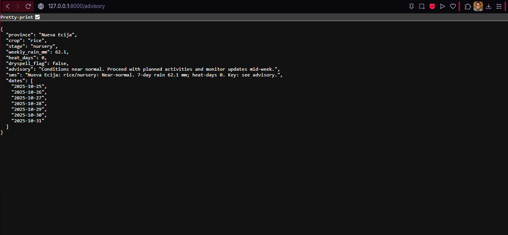
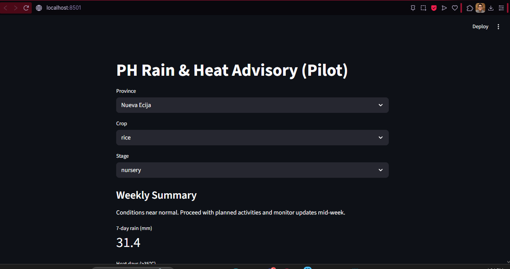

# PH-CIS: Rain & Heat Advisory (Pilot)

[](#license)
[]()
[]()
[]()

Tiny, working climate information service (CIS) for **Nueva Ecija** and **Isabela** (PH).
Generates weekly, crop-aware advice for **rice** and **corn** from simple metrics:
7-day rainfall, heat-days (≥35 °C), and a dry-spell flag. Bilingual output (EN/TL),
CSV export for LGU blasts, and a one-screen UI.

> ⚠️ Pilot quality. Thresholds and phrasing are first draft. See **[Methods & Assumptions](docs/methods.md)**.

---

## Table of contents
- [Demo](#demo)
- [Features](#features)
- [Quickstart](#quickstart)
- [API](#api)
- [UI](#ui)
- [Data](#data)
- [Directory layout](#directory-layout)
- [Roadmap](#roadmap)
- [For extension officers](#for-extension-officers)
- [License](#license)

---

## Demo

**API JSON**


**UI**


> Put screenshots here:
> - `docs/img/api_json.png` – the `/advisory` JSON like your browser screenshot  
> - `docs/img/ui_page.png` – Streamlit page with metrics/advisory

---

## Features
- **Actionable advice** mapped to crop and stage (not just weather numbers)
- **Bilingual** output: English and Tagalog (`lang=en|tl`)
- **CSV export** for LGU/SMS workflows
- **FastAPI** backend with OpenAPI docs at `/docs`
- **Streamlit** single-page UI
- **Daily ETL** script to refresh cached forecast

---

## Quickstart

```bash
# 1) create & activate virtual env (PowerShell)
python -m venv .venv
.\.venv\Scripts\Activate.ps1

# 2) install deps
python -m pip install -r requirements.txt

# 3) fetch 7-day forecast for pilot provinces
python -m etl.fetch

# 4) run API
python -m uvicorn api.app:app --reload
# browse: http://127.0.0.1:8000/docs

# 5) run UI (new terminal, from repo root)
# optional but recommended:
$env:PYTHONPATH = "$PWD"
streamlit run ui/app.py
