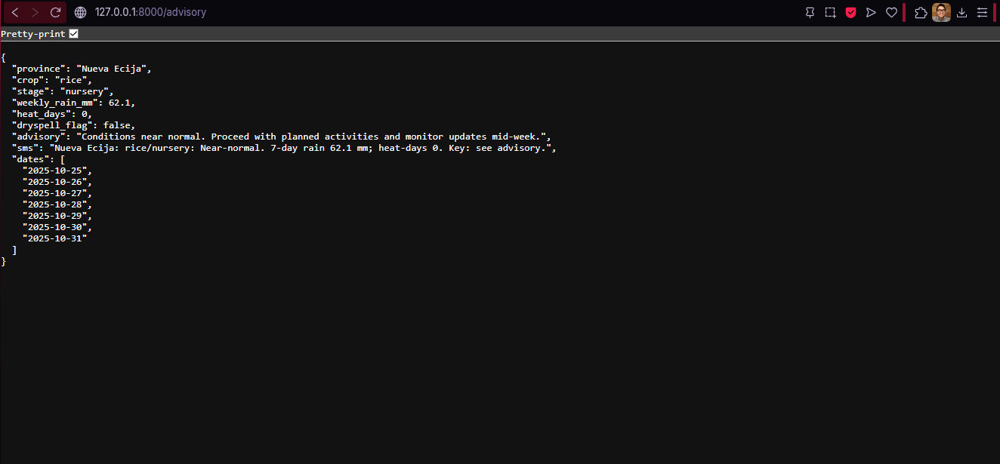
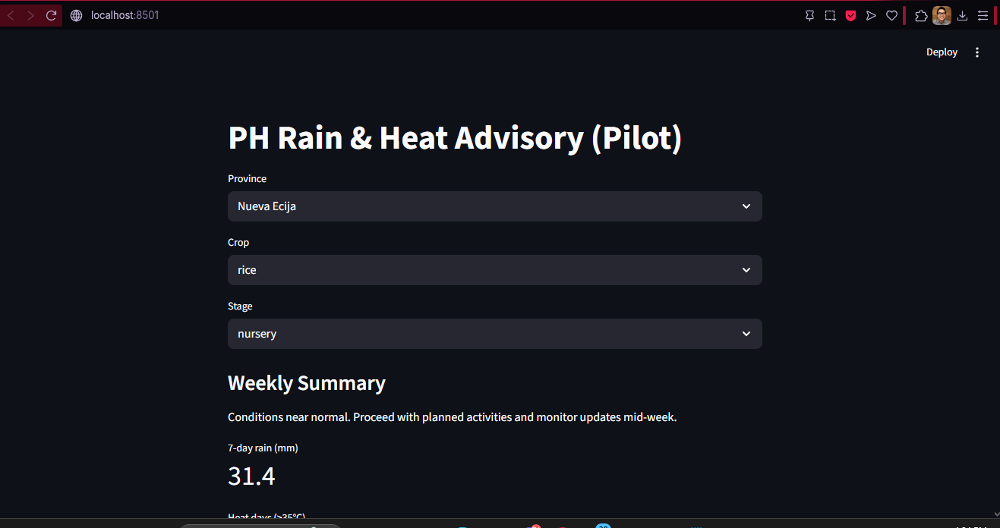

# PH-CIS: Rain & Heat Advisory (Pilot)

[](#license)
[]()
[]()
[]()

Tiny, working climate information service (CIS) for **Nueva Ecija** and **Isabela** (PH).
Generates weekly, crop-aware advice for **rice** and **corn** from simple metrics:
7-day rainfall, heat-days (≥35 °C), and a dry-spell flag. Bilingual output (EN/TL),
CSV export for LGU blasts, and a one-screen UI.

> ⚠️ Pilot quality. Thresholds and phrasing are first draft. See **[Methods & Assumptions](docs/methods.md)**.

---

## Table of contents
- [Demo](#demo)
- [Features](#features)
- [Quickstart](#quickstart)
- [API](#api)
- [UI](#ui)
- [Data](#data)
- [Directory layout](#directory-layout)
- [Roadmap](#roadmap)
- [For extension officers](#for-extension-officers)
- [License](#license)

---

## Demo

**API JSON**


**UI**


---

## Features
- **Actionable advice** mapped to crop and stage (not just weather numbers)
- **Bilingual** output: English and Tagalog (`lang=en|tl`)
- **CSV export** for LGU/SMS workflows
- **FastAPI** backend with OpenAPI docs at `/docs`
- **Streamlit** single-page UI
- **Daily ETL** script to refresh cached forecast

---

## Quickstart

```bash
# 1) create & activate virtual env (PowerShell)
.\.venv\Scripts\python.exe -m uvicorn api.app:app --reload

# 2) install deps
python -m pip install -r requirements.txt

# 3) fetch 7-day forecast for pilot provinces (required before /advisory works)
python -m etl.fetch

# 4) run API
python -m uvicorn api.app:app --reload
# browse: http://127.0.0.1:8000/docs

# 5) run UI (new terminal, from repo root)
# optional but recommended:
Set-ExecutionPolicy -Scope Process -ExecutionPolicy RemoteSigned
.\.venv\Scripts\Activate.ps1
streamlit run ui/app.py

# 6) Access the information of the website below:
 API direct site: http://127.0.0.1:8000/advisory?province=nueva_ecija&crop=rice&stage=nursery&lang=tl
 UI Link: http://localhost:8501

```

## API

- `GET /health` reports whether each province forecast cache exists and contains required daily forecast keys.
- `GET /advisory?province=nueva_ecija&crop=rice&stage=nursery&lang=en` returns one advisory. Run `python -m etl.fetch` first so the required forecast cache exists. Use `lang=en` for English or `lang=tl` for Tagalog.
- `GET /advisory_bulk?lang=tl` returns all configured province/crop/stage advisories.
- `GET /advisory_bulk` also accepts repeated `province`, `crop`, and `stage` query parameters for requested combinations.
- `POST /advisory_bulk?lang=en` accepts a JSON body like `{"combinations":[{"province":"nueva_ecija","crop":"corn","stage":"vegetative"}]}`.
- `GET /export/csv?province=nueva_ecija&crop=rice&stage=nursery&lang=en` downloads CSV columns for province, crop, stage, metrics, advisory, SMS, and date coverage.
